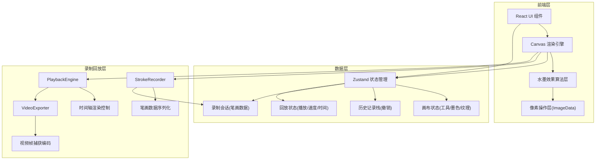

## 1. 架构设计



## 2. 技术说明
- **前端**：React@18 + TypeScript + Tailwind CSS@3 + Vite
- **初始化工具**：vite-init (react-ts 模板)
- **后端**：无（纯前端应用）
- **数据库**：无
- **状态管理**：Zustand
- **核心渲染**：Canvas 2D API + ImageData 像素操作
- **图标库**：lucide-react
- **视频录制**：MediaRecorder API + Canvas.captureStream()
- **数据序列化**：JSON 格式存储笔画数据

## 3. 路由定义
| 路由 | 用途 |
|------|------|
| / | 画布创作主页面 |

## 4. 核心模块设计

### 4.1 水墨渲染引擎 (InkRenderer)

**笔触扩散算法**：
- 使用多层Canvas叠加：底层宣纸纹理、中层墨迹层、顶层交互层
- 毛笔笔触通过贝塞尔曲线插值生成平滑路径
- 每个笔触点生成一个带高斯分布的墨点，边缘透明度渐变模拟晕染
- 使用 `ImageData` 像素级操作实现墨的扩散：对每个新墨点，计算其与周围像素的浓度差，按浓度梯度向外扩散
- 墨色浓淡：根据 `PointerEvent.pressure` 和移动速度计算墨色浓度，慢速/重压=浓墨，快速/轻压=淡墨
- 墨色加深：笔触停留区域的像素值随时间叠加，模拟墨在宣纸上的积墨效果

**清水晕染算法**：
- 清水笔触经过的区域，读取已有墨迹像素
- 对墨迹像素执行模糊扩散操作：将墨像素向周围低浓度区域扩散
- 使用可变半径的高斯模糊，模糊半径随水量和墨浓度动态调整
- 扩散方向受宣纸纤维纹理影响，产生不规则晕染

**墨滴扩散算法**：
- 点击位置生成一个墨点核心
- 使用 Perlin 噪声生成随机扩散方向图
- 墨滴沿噪声方向向外扩散，扩散速度和距离与墨浓度正相关
- 扩散过程中产生分支，模拟墨花的不规则形态
- 使用 requestAnimationFrame 驱动扩散动画

### 4.2 宣纸纹理生成
- 使用 Canvas 程序化生成宣纸纹理：
  - **生宣**：粗纤维纹理，吸墨性强，扩散范围大
  - **熟宣**：细密纹理，吸墨性弱，扩散范围小
  - **皮纸**：中等纤维，带斑点纹理
- 纹理通过噪声函数叠加生成，作为Canvas底层

### 4.3 笔画记录器 (StrokeRecorder)

**数据结构设计**：
```typescript
interface StrokePoint {
  x: number;
  y: number;
  pressure: number;
  time: number;
}

interface BrushStroke {
  id: string;
  startTime: number;
  endTime: number;
  tool: 'brush' | 'water';
  inkDensity: number;
  brushSize: number;
  paperType: string;
  points: StrokePoint[];
  dwellEvents: DwellEvent[];
}

interface InkDropStroke {
  id: string;
  startTime: number;
  endTime: number;
  tool: 'inkDrop';
  x: number;
  y: number;
  inkDensity: number;
  brushSize: number;
  paperType: string;
}

interface RecordingSession {
  id: string;
  startTime: number;
  endTime: number;
  strokes: Stroke[];
  canvasWidth: number;
  canvasHeight: number;
  paperType: string;
}
```

**核心功能**：
- 实时记录每一笔的时间戳、坐标、压力、笔刷参数
- 支持记录停笔积墨事件（dwellEvents）
- 支持录制会话的导入/导出（JSON格式）
- 精确到毫秒级的时间记录

### 4.4 回放引擎 (PlaybackEngine)

**核心功能**：
- 加载录制会话，根据时间轴精确重放每一笔
- 支持 0.5x-8x 倍速播放，保持动画流畅性
- 支持进度条跳转，快速渲染到任意时间点
- 支持播放/暂停/重置控制
- 回放时调用与实时绘画相同的渲染算法，确保效果一致
- 独立于主绘画引擎，使用独立的Canvas实例避免干扰

**时间轴控制**：
- 使用 requestAnimationFrame 驱动回放循环
- 帧时间计算考虑播放速度倍率
- 笔画插值：在两个记录点之间进行平滑插值
- 积墨事件按记录的持续时间逐帧渲染

### 4.5 视频导出器 (VideoExporter)

**技术方案**：
- 使用 Canvas.captureStream() 捕获画布视频流
- 使用 MediaRecorder API 进行视频编码
- 支持 WebM 格式（VP9/VP8 编码）
- 支持自定义帧率（15-60 FPS）、画质、播放速度
- 导出时自动合成宣纸纹理背景和水印

**核心流程**：
1. 重置回放引擎到起始点
2. 创建导出用Canvas，按指定分辨率缩放
3. 启动 MediaRecorder 录制视频流
4. 按指定速度回放，逐帧渲染到导出Canvas
5. 回放完成后停止录制，生成Blob
6. 触发浏览器下载

### 4.6 组件架构
| 组件 | 职责 |
|------|------|
| `App` | 根组件，路由 |
| `InkCanvas` | 画布主组件，管理Canvas层和事件 |
| `Toolbar` | 浮动工具栏(毛笔/清水/墨滴) |
| `BrushSettings` | 墨色和笔触大小调节 |
| `ActionBar` | 撤销/清空/录制/回放/导出/纹理切换 |
| `PaperSelector` | 宣纸纹理选择面板 |
| `PlaybackControls` | 回放控制器(播放/暂停/进度条/倍速) |
| `ExportPanel` | 导出面板(视频/GIF/参数调节) |

### 4.7 Store状态
```typescript
interface InkStore {
  // 绘画状态
  tool: 'brush' | 'water' | 'inkDrop'
  inkDensity: number
  brushSize: number
  paperType: 'raw' | 'cooked' | 'bark'
  showPaperSelector: boolean
  
  // 回放状态
  playbackMode: 'idle' | 'recording' | 'playing' | 'paused' | 'exporting'
  currentSession: RecordingSession | null
  playbackTime: number
  playbackSpeed: number
  showPlaybackControls: boolean
  showExportPanel: boolean
  strokeCount: number
  
  // Actions
  setTool: (tool: Tool) => void
  setInkDensity: (density: number) => void
  setBrushSize: (size: number) => void
  setPaperType: (type: PaperType) => void
  setShowPaperSelector: (show: boolean) => void
  setPlaybackMode: (mode: PlaybackMode) => void
  setCurrentSession: (session: RecordingSession | null) => void
  setPlaybackTime: (time: number) => void
  setPlaybackSpeed: (speed: number) => void
  setShowPlaybackControls: (show: boolean) => void
  setShowExportPanel: (show: boolean) => void
  setStrokeCount: (count: number) => void
}
```

## 5. 性能优化策略
- 多层Canvas分离：宣纸纹理层(静态) + 墨迹层(动态) + UI层
- 墨迹扩散计算使用 Web Worker 避免阻塞主线程
- 使用 `requestAnimationFrame` 控制渲染帧率
- 历史记录使用差异压缩而非全量存储
- 导出时合并Canvas层生成高清图
- 笔画数据增量记录，避免重复存储相同参数
- 回放时使用时间片调度，避免长时间阻塞主线程
- 视频导出使用流式编码，内存占用可控
